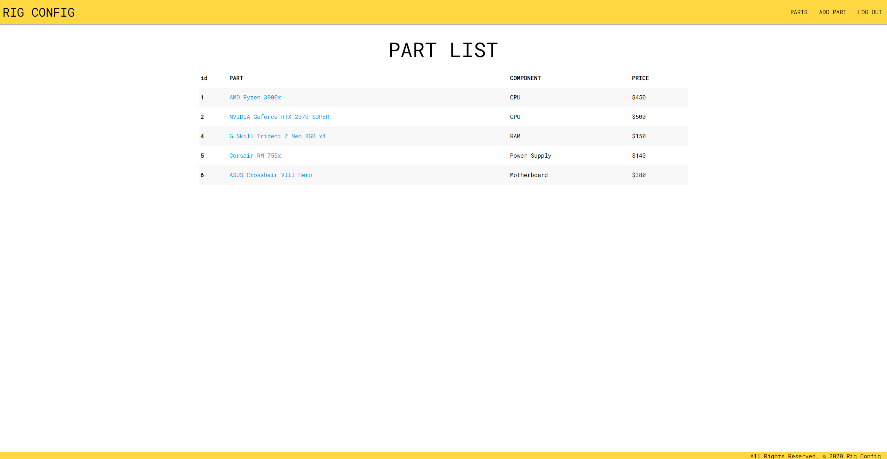
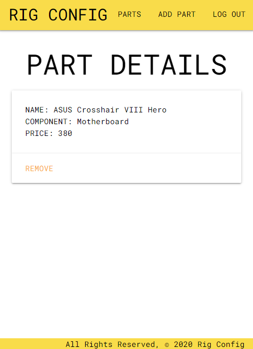

# [Rig Config](https://rigconfig.herokuapp.com/)

### Tablet Part Details View

# Objective

-   Allow users to keep track of different computer hardware components

# Technologies Used

-   Python
-   Django
-   PostgreSQL
-   HTML
-   CSS

# [Trello Board](https://trello.com/b/JVBUfO8Z/rigconfig)

# User Stories

-   As a user I want to add parts to my list
-   As a user I want to be able to remove a part
-   As a user I want to see an index of all parts
-   As a user I want to add new parts to the collection

# Future Plans

-   Implement a wish list
-   Make third party API calls to get different components
